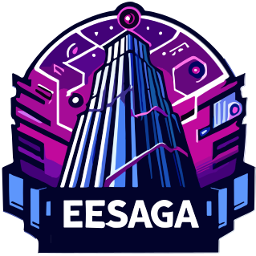

# 螺母战记 / EESaga

  

  
  
  

电子系第七届软设参赛作品

## 构建方式

本软件使用 Godot 引擎开发，使用 C# 语言编写。在构建前请安装以下软件：

- [Godot Engine - .NET 4.2.1](https://godotengine.org/download/windows/)
- [Visual Studio 2022](https://visualstudio.microsoft.com/zh-hans/vs/) （需要安装 .NET 桌面开发）

建议使用 Visual Studio Community 2022 开发。在 Godot 中打开项目后，点击 编辑器 -> 编辑器设置 -> .NET -> 编辑器 -> External Editor，选择 Visual Studio。

## 设计说明

本软件虚构了一个一名大学生勇闯螺母楼、拯救校园的故事。主角所在的校园发生了异变，螺母楼结构发生了变化，而且校园中出现了大量的敌人。主角需要攀登螺母楼，解开螺母楼的秘密，拯救校园。

玩家每次遇到敌人时都会触发战斗。战斗采用回合制，玩家可以选择攻击、防御、使用技能等。战斗胜利后，玩家可以获得经验值和金币。经验值可以提升等级，金币可以购买装备。

### 已经实现的功能

- 单次战斗中完整的回合制战斗系统，包括攻击、防御、技能等。
- 玩家角色的基本属性，包括生命值、攻击力、防御力、魔法值等。
- 敌人角色的基本属性，包括生命值、攻击力、防御力等。
- 敌人角色的 AI，包括攻击、防御、使用技能等。
- 战斗完成后的抽卡页面（暂未实装）。

### 尚未实现的功能

- 战斗完成后关卡的切换。
- 数值调整。
- Boss 战斗。

## 使用说明

本软件为单机游戏，无需联网。在游戏中，玩家可以使用鼠标进行操作。

- 在玩家的回合中，在地图上点击可以移动。
- 玩家可以点击卡牌进行攻击、防御、使用技能等。